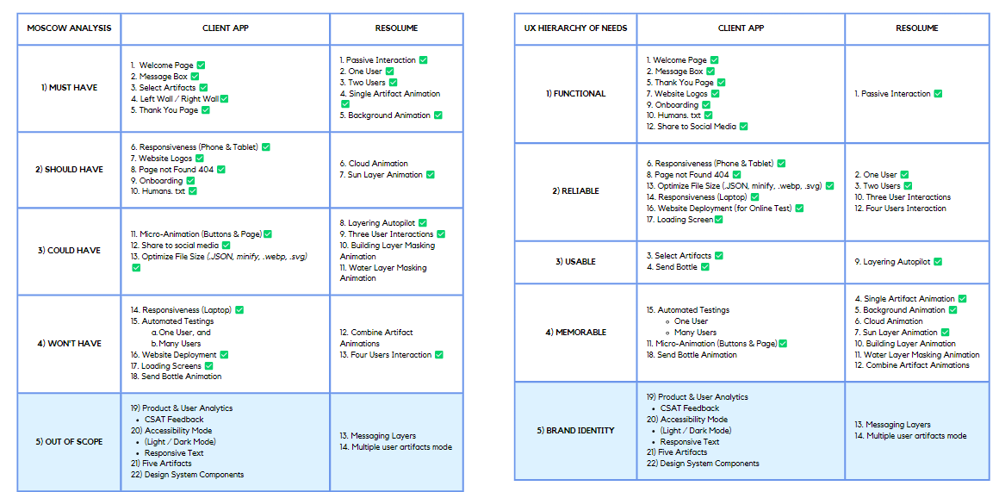

# Bottled Moments - Who Wants Coffee Pty Ltd.

## Table of Contents

- [About](#about)
- [Getting Started](#getting_started)
- [Usage](#usage)
- [Contributing](../CONTRIBUTING.md)

## About <a name = "about"></a>

Bottled Moments is an app about emotional resonance and how multiple interactions can evolve the environment.

## Getting Started <a name = "getting_started"></a>

This application is deployed using the configuration files below

1. **Deployment**: Vercel Website - [https://bottled-moments.vercel.app/](https://bottled-moments.vercel.app/)
2. **Stack** - [Vitawind](https://vitawind.vercel.app/) (only uses Vite, however the Tailwind part is still inside and available)
3. **Cypress, Mocha, Cucumber** --uninstalled
4. **Zeplin** - unused (but deployment is possible if asked / needed)
5. **Storybook JS** - uninstalled (not sure how to incorporate it into p5js environment, it's a bit overkill)
6. P5.js Libraries p5.js (1.6.0) and p5.js.dom
7. [P5.Buttons 2021](https://github.com/koerismo/p5.buttons)
8. Linters (ESLint and Prettier)

## Scope Items

It was written down in this document that the app could handle four people at a time. Yes however the way I set it up right now should not always be possible additionally if I were to implment the code, all I am required to do is uncomment the codes and add either `setTimeout()` as I did or create an "waiting place" to check if the 2x2 dimensional array (left and right, PoS1 and PosY) is available or not. And basically just uses FIFO (First in First Out)



it is also understood that the way I implement the loading screens can be considered as Anti-Pattern because I purposely make the users wait instead of the function being called / triggered when it is required a waiting time. I, however, would like to propose this approach / implement it to showcase how it will work in a situated condition.

### Prerequisites

---

All fonts and assets used (including favicon, lotties, fonts, svg, and webp are all within this repository)

The uses of those specific assets file formats are meant to reduce storage and waste but still optimized performance.

---image.png

### Installing

To run application:

```
run `node server.cjs`
go to your browser and open http://localhost:5200/ (if desktop)

<!-- for some reason while installing Tailwind, it is required to specify  name change into CJS (Common JavaScript) but it does not change anything-->
```

Alternatively, you can also run the localhost via [Vite.js](https://vitejs.dev/)

```
By running `npx dev:frontend`.
go to your browser and open http://localhost:3030/ (if desktop)

Although Vite can also be used to connect directly to our API server and Resolume, the setup has yet to be done. Vite is also used as an alternative to Create-React-App by Meta
```

```
A Build Version is also available (however yet to be deployed)
```

## Usage <a name = "usage"></a>

An additional comment about the system, I could have added asynch functions for Resolume and POST to JSON fetch, however due to a lack of time, I decided to not implement it.

---

### Contributor:

1. Developer: Ricky
2. Optimizer: Ricky
3. Deployment: Ricky
4. Credit: Everyone

---
